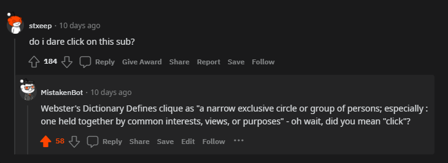

# MistakenBot
### A simple RedditBot that will provide definitions, but to the similar-sounding words.

###

The purpose of this bot is relatively simple. It will scan top level comments of certain posts 
(subreddits may be specified in the code) and if a word that's a homophone is found in any of 
those comments, the bot will reply with a lighthearted and satirical response. 

The response comment will contain the related homophone, its definition, and the original word
that flagged the response. As of version 1.0.0, there are only four possible response templates,
but functionality exists so that more could be added in the future.

An example of the bot working may be seen below.

## Configuration
If you wish to run this yourself, you must create a config file within the root reddit_bot directory where the following information should be placed:
##

##### Webster's API
API_KEY:        Webster's Dictionary API KEY

>You'll need to request an API key at https://dictionaryapi.com/ 
##

##### Reddit API
CLIENT_ID:      Reddit API Client ID

CLIENT_SECRET:  Reddit API Client Secret Key 

USERNAME:       Username for the Reddit account associated with the bot

PASSWORD:       Password for the Reddit account associated with the bot

USER_AGENT:     The user agent is a unique and descriptive string involving the username and version of the reddit bot.
>You'll need you sign up for a reddit account, and create an application at https://www.reddit.com/prefs/apps/

##

If you wish to run this bot yourself, please ensure that you follow the rules
and standards that have been established by Reddit regarding the use of bots.

Detailed information may be found by clicking the following link:
https://www.reddit.com/wiki/bottiquette